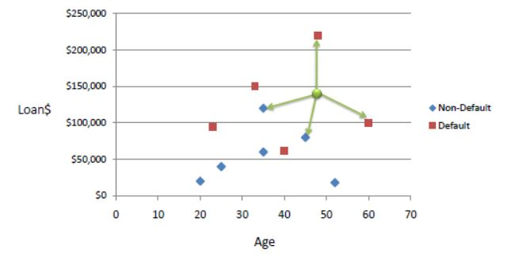

<h2>K Nearest Neighbors</h2>

<h3>Intro</h3>
<ul>
  <li>All of the already classfied cases are called neighbours to the new taken case.</li>
  <li>Classified case means it has a label assigned to it.</li>
  <li>With this method we want to assign the label to a new case based on the distance comparison to all cases using distance function.</li>
  <li>K nearest neighbours means k as an amount of closest (similar with the value) cases.</li>
   
  
   
  <li>Credits go to www.saedsayad.com</li>
</ul>

<h3>Machine Learning for model training</h3>
<ul>
  <li>We use the data already classified to train a model dividing data to subsets:
     
    - training samples - each sample is the set of featrues  
    - training labels - for each training sample we have label assigned based on the sample's features  
    - test samples - based on test samples we want to predict labels using trained model --> WE'RE GETTING PREDICTION SET AS OUTCOME  
    - test labels - we are using test labels to compare them with PREDICTION OUCOME --> WE'RE GETTING THE ASSESSMENT OF MODEL RELIABILITY  
  </li>
  <li>The trained model classifies previously unseen data to the corresponding label.
     
    - when model reliability is satisfing, we can take a new case with its features and classify it to a label.
  </li>
</ul>

